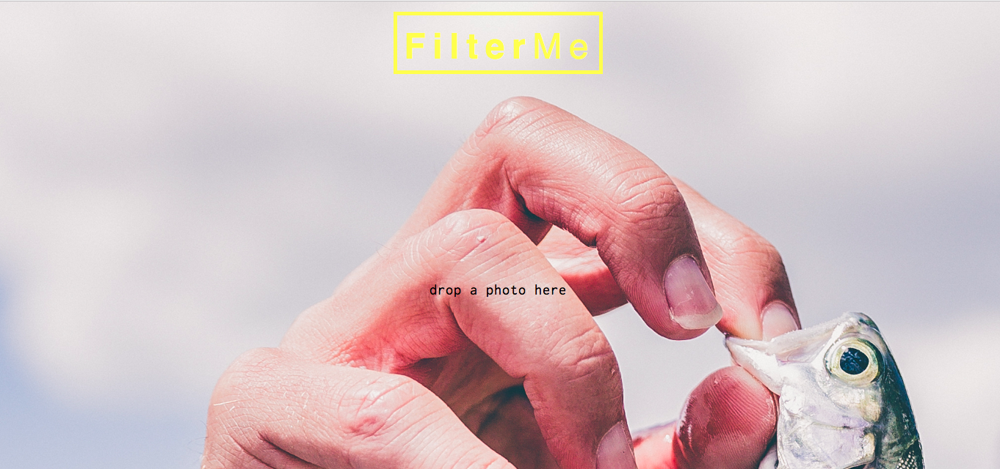

## Introduction
This is a little filter app which enables one to drag and drop an image, which is then resized to fit into a 500x500 square and can then be applied funky filters to.



## Instructions
Click [here] (https://sity-filter-me.herokuapp.com/) to explore it online.

To install and use locally:
```
$ git clone git@github.com:sitypop/filter_me.git
$ cd filter_me
$ node bin/http-server
```
Then open your browser, visit `http://localhost:8080`.

## Tools used
* JQuery
* fileReader plugin - elaborate
* JQuery MouseWheel
* Canvas - lok up
* Caman plugin - elaborate
